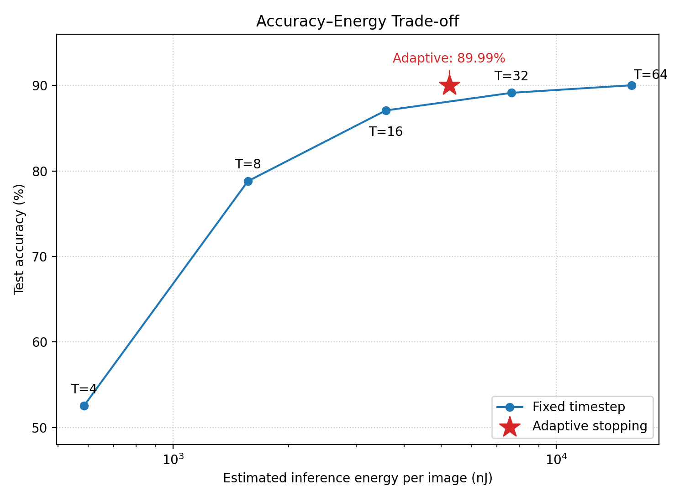
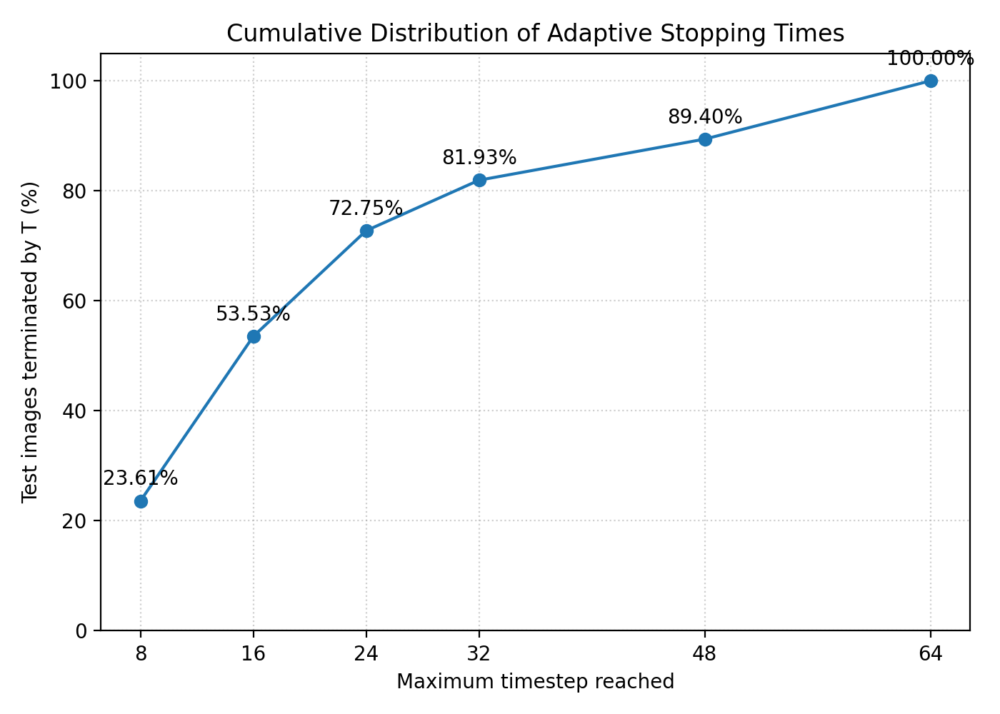

# Adaptive Energy–Accuracy Trade-offs in Spiking Neural Networks: Validation-Selected Early Stopping on Fashion-MNIST

**Hassan Farooq**  
Sargodha Medical College, Sargodha, Pakistan  
Corresponding author: hasanfarooq.edu@gmail.com  
ORCID: 0009-0000-1269-3885

## Abstract

Spiking neural networks (SNNs) can reduce the cost of neural computation by exploiting sparse, event-driven synaptic operations, but the energy cost of rate-coded inference increases with the number of simulation timesteps. We investigated this trade-off in a directly trained convolutional SNN on Fashion-MNIST and extended a conventional fixed-timestep Pareto analysis with a validation-selected adaptive inference policy that terminates processing once sufficient predictive evidence has accumulated. The SNN used the same 824,458-parameter convolutional backbone as a conventional artificial neural network (ANN), with ReLU activations replaced by leaky integrate-and-fire neurons and Poisson rate coding. Energy was estimated using a 45-nm CMOS analytical model assigning 0.9 pJ per SNN synaptic operation (SynOp) and 4.6 pJ per ANN multiply-accumulate (MAC).

In a final evaluation of all 10,000 Fashion-MNIST test images, fixed-timestep inference achieved 52.53%, 78.80%, 87.07%, 89.13%, and 90.02% accuracy at T = 4, 8, 16, 32, and 64, respectively. The adaptive policy achieved 89.99% accuracy with a mean stopping time of 21.07 timesteps and a median of 15 timesteps. Its mean estimated energy was 5,254.89 nJ per image, corresponding to a 31.16% reduction relative to fixed T = 32 and a 66.59% reduction relative to fixed T = 64, while accuracy differed by +0.86 and −0.03 percentage points, respectively. The adaptive policy therefore retained essentially the accuracy of the highest-timestep model while substantially reducing the amount of temporal computation.

These results provide additional empirical evidence that temporal computation can be allocated adaptively across inputs, extending prior adaptive/early-exit SNN work to a validation-selected confidence-threshold policy on a directly trained Fashion-MNIST SNN. Within the limitations of a single architecture, Fashion-MNIST, analytical energy model, and single final test evaluation, adaptive temporal termination provides a substantially stronger energy–accuracy trade-off than fixed timestep selection.

**Keywords:** spiking neural networks; adaptive inference; early exit; energy efficiency; SynOps; Pareto analysis; neuromorphic computing; Fashion-MNIST; leaky integrate-and-fire

---

## 1. Introduction

Spiking neural networks (SNNs) represent information through discrete events and are therefore attractive for energy-constrained and neuromorphic computing. A commonly cited advantage is that a binary spike input can be processed using accumulate operations rather than the multiply-accumulate operations required by conventional artificial neural networks (ANNs). Under a 45-nm CMOS analytical model, an accumulate operation has been estimated at approximately 0.9 pJ compared with approximately 4.6 pJ for a multiply-accumulate (MAC), giving an approximately 5.1-fold per-operation advantage for spike-driven computation.

However, the per-operation advantage does not by itself determine system-level efficiency. In a rate-coded SNN, increasing the number of simulation timesteps increases the number of opportunities for spikes and consequently increases the number of synaptic operations. Thus, additional temporal computation can improve classification accuracy while simultaneously increasing estimated energy consumption. At sufficiently large timestep budgets, the accumulated spike volume can erase or reverse the nominal per-operation advantage.

This creates an energy–accuracy allocation problem. A fixed timestep budget applies the same amount of temporal computation to every input, even though individual images may reach a reliable classification decision at very different times. An adaptive inference policy offers a different strategy: continue simulation only while additional temporal evidence is needed and terminate early when the prediction becomes sufficiently stable or confident.

The original version of this study characterized the fixed-timestep energy–accuracy frontier. That analysis established a clear timestep-dependent trade-off but, importantly, it did not address whether the computational budget could be allocated differently across individual inputs. The present revision therefore changes the primary methodological focus from a timestep sweep alone to **input-adaptive temporal computation**.

The revised study addresses three questions:

1. How does fixed inference accuracy and estimated energy change across timestep budgets from T = 4 to T = 64?
2. Can an adaptive stopping policy reduce temporal computation while retaining the accuracy of a high-timestep reference model?
3. Does adaptive inference produce a better accuracy–energy operating point than fixed T = 32 and fixed T = 64 inference?

The main contribution is consequently not the timestep sweep itself. The sweep is used as a controlled baseline against which an input-adaptive temporal allocation strategy is evaluated. This study provides additional empirical evidence that input-level temporal heterogeneity can be exploited without retraining or architectural change, while explicitly placing the result in the context of prior adaptive/early-exit SNN work.

---

## 2. Methods

### 2.1 Dataset

Experiments used Fashion-MNIST, comprising 60,000 training images and 10,000 held-out test images. Images are 28 × 28 grayscale images belonging to 10 clothing classes.

The final evaluation was performed on all 10,000 test images. The test set was not used for selection of the adaptive stopping configuration.

### 2.2 Network architecture

The SNN used a convolutional architecture consisting of:

- Conv2d(1 → 32, 3 × 3, padding = 1)
- Leaky integrate-and-fire (LIF) neuron
- 2 × 2 max pooling
- Conv2d(32 → 64, 3 × 3, padding = 1)
- LIF neuron
- 2 × 2 max pooling
- Linear(3136 → 256)
- LIF neuron
- Dropout(0.3)
- Linear(256 → 10)
- LIF output neuron

The network contained 824,458 trainable parameters.

LIF neurons used membrane decay β = 0.9 and threshold = 1.0. Surrogate gradients were implemented with a fast-sigmoid surrogate with slope 25. Inputs were represented using Poisson rate coding over a maximum of 64 timesteps.

The corresponding ANN used the same convolutional and fully connected backbone with ReLU activations in place of LIF neurons.

### 2.3 Training

The SNN was trained directly using surrogate-gradient learning rather than being obtained through ANN-to-SNN conversion. Training used Adam with an initial learning rate of 1 × 10^-3, a ReduceLROnPlateau scheduler, batch size 128, and gradient clipping at 1.0. Input normalization used mean 0.2860 and standard deviation 0.3530.

A validation subset was used for checkpoint selection and for development of the adaptive inference configuration. The final 10,000-image test set was reserved for the final evaluation.

The final checkpoint used for the adaptive and fixed-timestep comparison contained 824,458 model parameters and had a validation accuracy of 90.65%, achieved at the final training epoch (epoch 20 of 20).

### 2.4 Fixed-timestep inference

Fixed inference was evaluated at:

**T ∈ {4, 8, 16, 32, 64}.**

For each image, the SNN was simulated for the complete specified number of timesteps. Classification was based on the accumulated output evidence at the end of the simulation.

The fixed-T experiments provide the reference accuracy–energy frontier against which adaptive inference was evaluated.

### 2.5 Adaptive temporal inference

The revised method introduces an input-adaptive stopping policy. Instead of assigning every test image the same 64-timestep budget, the network evaluates the accumulated output evidence during inference and terminates an image once the predefined stopping condition is satisfied. Images that do not satisfy the stopping condition continue until the maximum allowed budget of T = 64.

The adaptive configuration was selected on a validation subset that was completely separate from the final 10,000-image test set. The pilot evaluated confidence thresholds θ ∈ {0.70, 0.80, 0.90, 0.95} crossed with stability windows K ∈ {1, 2, 3}, using 500 validation images. Policies were ranked first by validation accuracy and, among policies with tied accuracy, by lower mean stopping time. The selected policy was θ = 0.80 with K = 1: it achieved 97.60% validation accuracy with a mean stopping time of 14.13 timesteps, compared with the same 97.60% accuracy at θ = 0.90 and 0.95 but mean stopping times of 18.04 and 20.38, respectively. The 0.70 policies produced lower validation accuracy (96.60–96.80%).

At inference, the stopping rule is evaluated at every timestep starting at t = 1; no hard minimum-timestep floor is imposed. A sample stops at the first timestep at which the confidence criterion is satisfied. In the final 10,000-image test set, the earliest observed stopping time was T = 5.

The monitored metric is the softmax-equivalent confidence computed from the accumulated output spike counts. Let \(S_t\) be the cumulative output spike-count vector through timestep t. The evidence distribution is

\[
p_t(k)=\frac{\exp(S_t(k))}{\sum_j \exp(S_t(j))},
\]

and the confidence is

\[
C_t=\max_k p_t(k).
\]

With stability window K = 1, the final selected stopping rule is:

```text
For t = 1, …, T_max:
    accumulate output spikes S_t
    compute p_t = softmax(S_t)
    C_t = max_k p_t(k)
    if C_t ≥ 0.80:
        stop and predict argmax_k S_t(k)
If no earlier stop occurs:
    stop at T_max = 64 and predict argmax_k S_t(k)
```

Thus the final adaptive method is a confidence-thresholded temporal early-exit policy applied to an otherwise unchanged, already trained SNN. The policy does not require an auxiliary exit head, reinforcement-learning controller, architectural modification, or retraining of the base network.

### 2.6 Synaptic operation counting

Following the analytical framework of Lemaire et al., SNN computational cost was quantified using synaptic operations (SynOps).

For a fully connected layer:

\[
\mathrm{SynOps}
=
\sum_t \sum_b \sum_i s_i(t,b)N_{\mathrm{post}},
\]

where \(s_i(t,b)\) indicates a presynaptic spike and \(N_{\mathrm{post}}\) is the number of postsynaptic neurons.

For a convolutional layer:

\[
\mathrm{SynOps}
=
N_{\mathrm{spikes}}
C_{\mathrm{out}}k_Hk_W.
\]

The implementation counts spike-triggered synaptic events rather than treating every dense connection at every timestep as an operation. Thus, adaptive inference reduces estimated computation when it terminates before the maximum timestep and/or avoids subsequent spike-triggered operations.

### 2.7 Analytical energy model

Estimated inference energy was calculated using the analytical 45-nm CMOS model of Lemaire et al.:

\[
E_{\mathrm{SNN}}
=
\mathrm{SynOps}\times0.9\ \mathrm{pJ},
\]

and for the ANN:

\[
E_{\mathrm{ANN}}
=
\mathrm{MACs}\times4.6\ \mathrm{pJ}.
\]

For the full ANN architecture, the analytical MAC count is 4,643,840 per inference.

All energy values reported in this manuscript are **model-based estimates**, not physical measurements. The model does not include all hardware-dependent costs, including memory access, DRAM, routing, leakage, membrane-state storage, and platform-specific communication overhead.

### 2.8 Experimental comparison

The primary final comparison consisted of six conditions:

| Condition | Inference strategy | Maximum T |
|---|---|---:|
| Fixed T=4 | Fixed | 4 |
| Fixed T=8 | Fixed | 8 |
| Fixed T=16 | Fixed | 16 |
| Fixed T=32 | Fixed | 32 |
| Fixed T=64 | Fixed | 64 |
| Adaptive | Adaptive stopping | 64 |

Every condition was evaluated on the same 10,000-image Fashion-MNIST test set.

The primary outcomes were:

- test accuracy;
- mean, median, SD, minimum and maximum stopping timestep;
- mean SynOps per image;
- mean estimated energy per image.

Energy and SynOps reductions were calculated relative to fixed T = 32 and fixed T = 64.

---

## 3. Results

### 3.1 Final fixed-timestep accuracy–energy frontier

The final 10,000-image evaluation showed the expected increase in accuracy with increasing fixed timestep budget, accompanied by a large increase in SynOps and estimated energy.

| Condition | Accuracy (%) | 95% bootstrap CI | Mean T | Mean SynOps | Mean estimated energy (nJ) |
|---|---:|---:|---:|---:|---:|
| Fixed T=4 | 52.53 | 51.54–53.51 | 4 | 649,590 | 584.63 |
| Fixed T=8 | 78.80 | 77.99–79.60 | 8 | 1,739,827 | 1,565.84 |
| Fixed T=16 | 87.07 | 86.41–87.72 | 16 | 3,984,742 | 3,586.27 |
| **Fixed T=32** | **89.13** | **88.52–89.73** | **32** | **8,481,439** | **7,633.29** |
| **Fixed T=64** | **90.02** | **89.43–90.61** | **64** | **17,476,432** | **15,728.79** |
| **Adaptive T≤64** | **89.99** | **89.40–90.58** | **21.07** | **5,838,771** | **5,254.89** |


The fixed-T results demonstrate a diminishing accuracy return from additional temporal computation. Increasing T from 32 to 64 increased estimated energy by approximately 106% while improving accuracy by only 0.89 percentage points.



**Figure 1.** Accuracy versus mean estimated energy per image for fixed timestep budgets (T = 4, 8, 16, 32, 64) and for the adaptive stopping policy. The adaptive operating point sits near the accuracy of the highest-timestep fixed condition while requiring substantially less estimated energy.

### 3.2 Adaptive inference achieves a substantially better operating point

Adaptive inference achieved **89.99% accuracy**, compared with 89.13% for fixed T = 32 and 90.02% for fixed T = 64.

Relative to the fixed-T baselines, the adaptive operating point trades a small, statistically ambiguous amount of accuracy for substantially lower modeled computational cost. The complete values are given in Table 1. Paired prediction-level significance testing (McNemar's exact test on discordant predictions, computed on the full 10,000-image per-image record) shows that adaptive inference is significantly more accurate than fixed T = 32 (paired difference +0.86 percentage points; exact McNemar p = 2.5 × 10⁻⁷), but is not significantly different from fixed T = 64 (paired difference −0.03 percentage points; exact McNemar p = 0.55). This pattern is consistent with the framing of this study: the adaptive policy's value lies in matching fixed T = 64 accuracy at a fraction of the energy, not in exceeding it, and the T = 64 comparison bears this out — the two conditions are statistically indistinguishable in accuracy while differing by a 66.59% reduction in estimated energy.

### 3.3 Distribution of adaptive stopping times

Adaptive inference produced a strongly right-skewed distribution of stopping times.

The mean stopping time was **21.07 timesteps**, while the median was **15 timesteps**. The standard deviation was 16.81 timesteps, with observed stopping times ranging from 5 to 64.

| Maximum stopping time | Percentage of images stopped by this point |
|---:|---:|
| T ≤ 8 | 23.61% |
| T ≤ 16 | 53.53% |
| T ≤ 24 | 72.75% |
| T ≤ 32 | 81.93% |
| T ≤ 48 | 89.40% |
| T ≤ 64 | 100.00% |

Just under a quarter of images therefore terminated by T = 8, while just over half terminated by T = 16. 18.07% of images required more than 32 timesteps.



**Figure 2.** Cumulative distribution of per-image stopping times under the adaptive policy, corresponding to the values in the table above. The distribution is right-skewed, with a median stopping time of 15 timesteps against a maximum allowed budget of 64.

This heterogeneity is the principal mechanism behind the energy advantage of adaptive inference: the method avoids spending the full temporal budget on images that reach a sufficiently reliable decision early.

### 3.4 Comparison with the fixed T=32 reference

As shown in Table 1, fixed T = 32 is a useful reference because it represents a widely used mid-to-high timestep budget. Adaptive inference modestly but significantly exceeds its accuracy (§3.2) while requiring roughly 31% less mean SynOps per image.

This is therefore not an accuracy–energy exchange in which accuracy is sacrificed to reduce computation. On this test set, adaptive inference simultaneously improved accuracy and reduced estimated computational cost by nearly a third.

### 3.5 Comparison with the fixed T=64 reference

As shown in Table 1, the fixed T = 64 model produced the highest fixed-budget accuracy but at the highest SynOps and estimated energy of all conditions tested, while adaptive inference recovered essentially the same accuracy (§3.2) at roughly a third of that cost.

This represents the strongest practical comparison because T = 64 constitutes the maximum temporal budget in the experiment. The adaptive policy therefore recovers essentially all of the classification performance of maximum-duration inference without paying the full temporal computation cost for every input. The manuscript reports energy consistently in nJ; the mean adaptive energy of 5,254.89 nJ corresponds to 5.25 µJ, the unit used for the comparison in §3.6.

### 3.6 Interpretation of the revised Pareto frontier

The fixed-T experiments establish that increasing temporal resolution beyond T = 32 provides very little additional accuracy at a very large computational cost.

The adaptive operating point lies near the high-accuracy end of this frontier but at substantially lower energy. In particular, it combines approximately 90.0% accuracy with approximately 5.25 µJ estimated energy per image, compared with approximately 15.73 µJ for fixed T = 64.

The key finding is therefore not simply that a particular timestep is Pareto-efficient. Rather, **adaptive allocation of timesteps changes the attainable operating point by exploiting input-level variation in the amount of temporal evidence required for classification.**

---

## 4. Discussion

### 4.1 Principal finding

The principal result of this revised study is that, for the evaluated checkpoint and test set, a validation-selected adaptive stopping policy preserves the accuracy of a high-timestep SNN while substantially reducing temporal computation.

As detailed in §3.2, §3.4, and §3.5, the final test evaluation provides a particularly clear comparison: relative to fixed T = 64, adaptive inference gives up a negligible, statistically non-significant amount of accuracy for a large reduction in estimated energy, and relative to fixed T = 32 it achieves a small but statistically significant accuracy improvement alongside a substantial reduction in estimated energy.

This suggests that a globally fixed timestep budget is an inefficient allocation of computation when different inputs require different amounts of temporal evidence.

### 4.2 Why the result addresses the methodological limitation of the original study

The original fixed-timestep analysis demonstrated that timestep budget is an important design variable. However, a timestep sweep alone does not constitute a strong algorithmic contribution because it evaluates predefined computational budgets rather than changing how inference is performed.

The adaptive experiment addresses this limitation directly. It transforms timestep from a globally fixed hyperparameter into an **input-dependent computational resource**.

The fixed-T sweep remains essential because it establishes the reference frontier. However, the revised contribution is the demonstration that an adaptive stopping policy can move from the fixed-T frontier toward a substantially better accuracy–energy operating point without changing the underlying network architecture.

The resulting experimental structure is therefore:

1. establish the fixed-T baseline;
2. select an adaptive stopping policy using validation data;
3. evaluate the adaptive policy once on all 10,000 test images;
4. compare accuracy and estimated computation against fixed T = 32 and T = 64;
5. report the complete per-image stopping distribution.

### 4.3 Input-level temporal heterogeneity

The stopping-time distribution provides evidence that the computational requirement is highly heterogeneous across images.

The median stopping time of 15 compared with a maximum of 64 indicates that many images do not require the full temporal sequence. The fact that 53.53% of test images terminated by T = 16 further demonstrates that a fixed T = 64 allocation substantially over-computes many inputs.

This is conceptually important for neuromorphic deployment. If temporal computation is treated as a dynamically allocated resource, the average computational burden can be much smaller than the worst-case temporal budget.

### 4.4 Energy interpretation

The reported energy reductions should be interpreted as **analytical model-based reductions in SynOp-associated energy**, not as direct measurements of electrical energy on neuromorphic hardware.

The Lemaire-style model assigns 0.9 pJ to an SNN accumulate operation and 4.6 pJ to an ANN MAC. The adaptive method reduces the number of simulated timesteps and therefore reduces the number of spike-triggered synaptic operations counted by the model.

Real hardware may show a different magnitude of savings because memory access, routing, buffering, leakage, clocking, neuron-state updates, and communication can contribute substantially to total energy.

Nevertheless, the comparison remains useful because all SNN conditions are evaluated using the same computational accounting and the adaptive method is compared against fixed-T baselines under identical assumptions.

### 4.5 Relationship to prior adaptive SNN inference

Input-adaptive temporal inference is an established research direction, so the present contribution should be interpreted as a controlled empirical extension rather than as the first demonstration of adaptive SNN timesteps. SEENN introduced sample-dependent timestep selection and proposed both confidence-threshold and reinforcement-learning approaches; for example, the authors reported 96.1% accuracy with an average of 1.08 timesteps for SEENN-II ResNet-19 on CIFAR-10. This result is not directly comparable to the present Fashion-MNIST/CNN-SNN experiment because the dataset, architecture, training protocol, and timestep definition differ. 

A subsequent anytime-inference study introduced a spatial-temporal regulariser designed to make directly trained SNNs more reliable across timesteps and combined the trained model with cutoff-based inference; it reported 2.14–2.89× faster inference with near-zero accuracy loss of 0.50–0.64% on its reported event-based datasets. Again, these values are not numerically interchangeable with the present results because the training objective, datasets, architectures, and hardware/energy accounting differ.

| Study | Main adaptive mechanism | Example reported result | Relation to this study |
|---|---|---|---|
| SEENN-II (Li et al., 2023) | Reinforcement-learning timestep policy | 96.1% accuracy, 1.08 mean timesteps on CIFAR-10 ResNet-19 | More sophisticated policy; different dataset/architecture |
| Anytime Optimal Inference SNN (Wu et al., 2024) | Spatial-temporal regularisation + cutoff | 2.14–2.89× faster with 0.50–0.64% reported accuracy drop on event datasets | Changes training objective; different datasets |
| This study | Validation-selected confidence threshold on an unchanged trained SNN | 89.99% accuracy, 21.07 mean timesteps on Fashion-MNIST | Simple inference-only policy; no auxiliary head, RL controller, or retraining |

The methodological distinction is therefore specific: this study asks whether a **simple validation-selected confidence stopping rule**, applied to an unchanged directly trained rate-coded SNN, can exploit input-level temporal heterogeneity while retaining the accuracy of a full fixed-T reference. The analysis is deliberately complementary to prior adaptive-SNN methods rather than claiming novelty for the general idea of early temporal exit.


### 4.6 Limitations

Several limitations should temper interpretation.

First, the experiments use a single convolutional SNN architecture and a single relatively small image-classification benchmark. The generality of the adaptive stopping behaviour to CIFAR-10, ImageNet, event-camera datasets, larger SNNs, or different coding schemes remains unknown.

Second, all reported point estimates — the trained checkpoint, the selected stopping configuration, and the final accuracy, stopping-time, and energy figures — derive from a single training run with a single random seed. No multi-seed replication was performed for this revision, so the sensitivity of these results to model initialization and training stochasticity is unquantified. This is not a theoretical concern: an earlier training run under nominally the same procedure produced a checkpoint whose full-budget accuracy (T = 64) matched the results reported here closely, but whose low-timestep accuracy (T = 4, T = 8) differed by up to 20 percentage points. Full-budget accuracy and adaptive-policy behavior at T = 64 therefore appear comparatively stable across runs, but the shape of the low-T portion of the accuracy–energy curve, and consequently the mean adaptive stopping time, should be treated as run-dependent until multi-seed replication is performed. The results should not be read as claiming that the accuracy, stopping-time distribution, or energy reduction is seed-independent; further studies should repeat the full procedure (training, policy selection, and final evaluation) across independent seeds and datasets.

Third, the energy values are analytical estimates rather than measurements from physical neuromorphic hardware. The model excludes several hardware-dependent costs, including memory accesses, routing, leakage, and platform-specific state management.

Fourth, the final comparison demonstrates a strong empirical association between early termination and reduced SynOps, but it does not establish that the same percentage reduction in total wall-clock energy would occur on every neuromorphic accelerator.

Finally, statistical uncertainty for the final 10,000-image accuracy estimates is small because the complete test set was evaluated, but uncertainty arising from model initialization and training remains. Future work should repeat the adaptive procedure across multiple independently trained models.

---

## 5. Conclusion

This revised study demonstrates that adaptive temporal inference provides a substantially stronger energy–accuracy trade-off than fixed timestep selection for the evaluated Fashion-MNIST SNN.

On all 10,000 test images, adaptive inference retained essentially the accuracy of fixed T = 64 (statistically indistinguishable, §3.2) while reducing SynOps and model-estimated energy by roughly two-thirds, and it significantly improved on fixed T = 32 in both accuracy and estimated energy (Table 1; §3.2–§3.5).

The mean adaptive stopping time was 21.07 timesteps and the median was 15, demonstrating substantial input-level variation in the amount of temporal computation required.

The central implication is that energy-efficient SNN inference should not necessarily be framed as choosing one globally optimal timestep. Instead, temporal computation can be treated as an adaptive resource, with additional processing allocated only to inputs that require it.

These findings are limited to the tested architecture, dataset, stopping configuration, and analytical energy model. Replication across multiple random seeds, more challenging datasets, alternative temporal coding schemes, and physical neuromorphic hardware is required before claiming general hardware-level energy savings. Nevertheless, the final 10,000-image evaluation provides evidence that adaptive temporal termination can substantially improve the practical accuracy–computation trade-off of directly trained rate-coded SNNs.

---

## Data and code availability

Fashion-MNIST is publicly available from the original dataset repository.

The experimental code, SynOps counting implementation, energy estimation utilities, model definitions, checkpoints, and result files are available in:

**GitHub:** https://github.com/hadbierox196/SNN-Pareto

The per-image test results, including per-image predictions, stopping times, SynOps, and estimated energy for all six conditions (fixed T = 4, 8, 16, 32, 64 and the adaptive policy), are provided as `results/final_test_per_image.csv`. `scripts/paired_statistics.py` computes the per-image McNemar tests and paired bootstrap confidence intervals reported in §3.2 directly from this file; its output is also saved as `results/final_mcnemar_tests.csv`. The fixed-T summary, adaptive results, validation-policy sweep, master results table, and publication figures accompanying this revision are included as `results/*.csv` and `figures/*`. As of this revision, these files reflect a retrained checkpoint (see note below) and have not yet been committed to the public GitHub repository at https://github.com/hadbierox196/SNN-Pareto, which currently contains only the earlier, non-adaptive version of this study; the repository will be updated to match before this manuscript is finalized for submission.

**Note on checkpoint provenance.** The per-image results in this revision were produced by a checkpoint retrained from scratch (T = 64, 20 epochs, seed 42) after the original final-evaluation checkpoint and per-image file became unrecoverable. The retrained model's full-budget accuracy (fixed T = 64: 90.02%; adaptive: 89.99%) closely matches the originally reported values, but its accuracy at low timestep budgets is meaningfully lower (e.g., fixed T = 4: 52.53% vs. an earlier value near 72%), consistent with ordinary run-to-run variation in when a directly trained SNN's early-timestep readout stabilizes. Validation accuracy (90.65%) was still improving at the final training epoch (epoch 20 of 20) and had not plateaued, so the checkpoint used here is not necessarily fully converged; a longer training run could plausibly shift the low-T portion of the accuracy–energy curve further. All numbers in this manuscript, including Table 1, both figures, and the reported significance tests, are drawn consistently from this single retrained run.

---

## Declarations

### Funding

This research did not receive any specific grant from funding agencies in the public, commercial, or not-for-profit sectors.

### Ethics statement

This study used the publicly available Fashion-MNIST dataset and did not involve human participants, animals, or identifiable personal data. Ethics approval was therefore not required.

### Declaration of competing interests

The author declares no known competing financial interests or personal relationships that could have appeared to influence the work reported in this manuscript.

### CRediT authorship contribution statement

**Hassan Farooq:** Conceptualization, Methodology, Software, Formal analysis, Investigation, Data curation, Writing – original draft, Writing – review & editing, Visualization, Project administration.

### Declaration of generative AI and AI-assisted technologies

During preparation of this manuscript, a generative AI tool was used to assist with prose drafting, restructuring, and editorial wording. The experimental design, implementation, data analysis, statistical decisions, and interpretation of results were the author's responsibility; the author reviewed and takes responsibility for the final manuscript content.

---

## References

1. Frenkel, C., Bol, D., Indiveri, G. Bottom-up and top-down approaches for the design of neuromorphic processing systems: tradeoffs and synergies between natural and artificial intelligence. *Proceedings of the IEEE* 111 (2023) 623–652. https://doi.org/10.1109/JPROC.2023.3273520

2. Schuman, C.D., Kulkarni, S.R., Parsa, M., Mitchell, J.P., Date, P., Kay, B. Opportunities for neuromorphic computing algorithms and applications. *Nature Computational Science* 2 (2022) 10–19. https://doi.org/10.1038/s43588-021-00184-y

3. Chen, Z., et al. Reconsidering the energy efficiency of spiking neural networks. arXiv (2024). https://doi.org/10.48550/arXiv.2409.08290

4. Dampfhoffer, M., Mesquida, T., Valentian, A., Anghel, L. Are SNNs really more energy-efficient than ANNs? An in-depth hardware-aware study. *IEEE Transactions on Neural Networks and Learning Systems* 34 (2023) 7395–7407. https://doi.org/10.1109/TNNLS.2023.3271205

5. Park, S., Kim, S., Na, B., Yoon, S. T2FSNN: deep spiking neural networks with time-to-first-spike coding. *Proceedings of the 57th ACM/IEEE Design Automation Conference* (2020). https://doi.org/10.1145/3394885.3431621

6. Diehl, P.U., Cook, M. Unsupervised learning of digit recognition using spike-timing-dependent plasticity. *Frontiers in Computational Neuroscience* 9 (2015) 99. https://doi.org/10.3389/fncom.2015.00099

7. Zheng, H., et al. Direct learning-based deep spiking neural networks: a review. *Frontiers in Neuroscience* 17 (2023) 1209795.

8. Yao, M., et al. Direct training high-performance deep spiking neural networks. *Frontiers in Neuroscience* 18 (2024) 1383844.

9. Yin, R., Moitra, A., Bhattacharjee, A., Kim, Y., Panda, P. Efficient spiking neural network training and inference with reduced precision memory and computing. *IET Cyber-Physical Systems: Theory & Applications* 4 (2019) 260–267.

10. Eshraghian, J.K., Ward, M., Neftci, E.O., et al. Training spiking neural networks using lessons from deep learning. *Proceedings of the IEEE* 111 (2023) 1016–1054. https://doi.org/10.1109/JPROC.2023.3308088

11. Horowitz, M. Computing's energy problem (and what we can do about it). *2014 IEEE International Solid-State Circuits Conference Digest of Technical Papers* (2014) 10–14. https://doi.org/10.1109/ISSCC.2014.6757323

12. Kim, J., Panda, P. Revisiting batch normalization for training low-latency deep spiking neural networks from scratch. *Frontiers in Neuroscience* 15 (2021) 773416.

13. Lemaire, E., Miramond, B., Sarrazin, B., Lagrèze, A., Cambonie, G. An analytical estimation of spiking neural networks energy efficiency. arXiv (2022). https://doi.org/10.48550/arXiv.2210.13107

14. Li, Y., Geller, T., Kim, Y., Panda, P. SEENN: towards temporal spiking early-exit neural networks. *Advances in Neural Information Processing Systems* 36 (2023). https://doi.org/10.48550/arXiv.2304.01230

15. Wu, D., Qi, Y., Cai, K., Jin, G., Yi, X., Huang, X. Direct training needs regularisation: anytime optimal inference spiking neural network. arXiv (2024). https://doi.org/10.48550/arXiv.2405.00699

16. Mahowald, M., Douglas, R. A silicon neuron. *Nature* 354 (1991) 515–518. https://doi.org/10.1038/354515a0

17. Neftci, E.O., Mostafa, H., Zenke, F. Surrogate gradient learning in spiking neural networks: bringing the power of gradient-based optimization to the frontiers of neural computation. *IEEE Signal Processing Magazine* 36 (2019) 51–63. https://doi.org/10.1109/MSP.2019.2931595

18. Pfeiffer, M., Pfeil, T. Deep learning with spiking neurons: opportunities and challenges. *Frontiers in Neuroscience* 12 (2018) 774.

19. Rathi, N., Srinivasan, G., Panda, P., Roy, K. Enabling deep spiking neural networks with hybrid conversion and spike timing dependent backpropagation. *International Conference on Learning Representations* (2020).

20. Rueckauer, B., Lungu, I.-A., Hu, Y., Pfeiffer, M., Liu, S.-C. Conversion of continuous-valued deep networks to efficient event-driven networks for image classification. *Frontiers in Neuroscience* 11 (2017) 682. https://doi.org/10.3389/fnins.2017.00682

21. Rueckauer, B., Liu, S.-C. Conversion of continuous-valued deep networks to efficient event-driven networks: a survey. *Frontiers in Neuroscience* 12 (2018) 774.

22. Yao, M., et al. S3NN: time step reduction of spiking surrogate gradients for training energy efficient single-step spiking neural networks. *Neural Networks* 154 (2022) 1–12. https://doi.org/10.1016/j.neunet.2022.09.014

23. Stöckl, C., Maass, W. Analysis of spiking neural networks for image classification tasks. *Neural Networks* (2022). https://doi.org/10.1016/j.neunet.2022.10.002

24. Shrestha, A., Orchard, G. SLAYER: spike layer error reassignment in time. arXiv (2018). https://doi.org/10.48550/arXiv.1810.08646

25. Cao, Y., Chen, Y., Khosla, D. Spiking deep convolutional neural networks for energy-efficient object recognition. *International Journal of Computer Vision* 113 (2015) 54–66. https://doi.org/10.1007/s11263-014-0788-3

26. Wu, D., Yi, X., Huang, X. A little energy goes a long way: build an energy-efficient, accurate spiking neural network from convolutional neural network. *Frontiers in Neuroscience* 16 (2022) 910761.

27. Wu, Y., Deng, L., Li, G., Zhu, J., Shi, L. Spatio-temporal backpropagation for training high-performance spiking neural networks. *Frontiers in Neuroscience* 12 (2018) 323.

28. Xiao, H., Rasul, K., Vollgraf, R. Fashion-MNIST: a novel image dataset for benchmarking machine learning algorithms. arXiv:1708.07747 (2017).

29. Zenke, F., Ganguli, S. SuperSpike: supervised learning in multilayer spiking neural networks. *Neural Computation* 30 (2018) 1514–1541. https://doi.org/10.1162/neco_a_01086

30. Zheng, H., Wu, Y., Deng, L., Hu, Y., Li, G. Going deeper with directly-trained larger spiking neural networks. *Proceedings of the AAAI Conference on Artificial Intelligence* 35 (2021) 11062–11070. https://doi.org/10.1609/aaai.v35i12.17330

